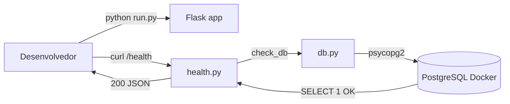

# Documentação — Fase 0: Setup do Projeto

Esta fase montou a base do **Sistema de Finanças Pessoais**: estrutura Flask, conexão com PostgreSQL, health check e instruções de setup. Nada de login, gastos ou importação ainda — só a fundação.

---

## Objetivo da fase

Entregar um projeto que:

1. Sobe com `docker compose up`
2. Roda com `python run.py`
3. Responde `GET /health` com status **200** quando o Postgres está acessível
4. Tem estrutura de pastas pronta para as próximas fases

---

## Estrutura criada

```
financas-platform/
├── app/
│   ├── __init__.py          # Factory do Flask (create_app)
│   ├── config.py            # Variáveis de ambiente
│   ├── rotas/
│   │   ├── __init__.py
│   │   └── health.py        # Endpoint GET /health
│   ├── servicos/
│   │   ├── __init__.py
│   │   └── db.py            # Conexão psycopg2
│   ├── sql/                 # Migrations futuras (.gitkeep)
│   └── templates/           # Jinja2 futuro (.gitkeep)
├── tests/
│   ├── __init__.py
│   └── test_health.py
├── docs/
│   └── fase-0.md            # Este arquivo
├── .env.example             # Template commitável
├── .env                     # Valores locais (gitignored)
├── .gitignore
├── docker-compose.yml
├── requirements.txt
├── run.py
└── README.md
```

---

## O que cada parte faz

### 1. Configuração (`app/config.py`)

Carrega variáveis do `.env` via `python-dotenv`:

| Variável | Função |
|----------|--------|
| `DATABASE_URL` | String de conexão PostgreSQL |
| `SECRET_KEY` | Chave para sessões Flask (fases futuras) |
| `FLASK_DEBUG` | Modo debug (`1` = ativo) |

Valores padrão batem com o `docker-compose.yml`.

### 2. Acesso ao banco (`app/servicos/db.py`)

Conexão direta com **psycopg2**, sem ORM:

- `get_connection()` — abre conexão com o Postgres
- `check_db()` — executa `SELECT 1` para validar que o banco responde

### 3. Health check (`app/rotas/health.py`)

Endpoint `GET /health`:

**Banco OK → 200**

```json
{"status": "ok", "database": "connected"}
```

**Banco indisponível → 503**

```json
{"status": "degraded", "database": "unreachable", "error": "..."}
```

### 4. Factory do Flask (`app/__init__.py`)

`create_app()` centraliza a criação da app e o registro de blueprints. Hoje só o `health_bp`; nas próximas fases entram login, gastos, upload etc.

### 5. Entry point (`run.py`)

Inicia o servidor em `http://0.0.0.0:5000` com debug ativo.

### 6. Docker (`docker-compose.yml`)

Sobe **apenas o PostgreSQL**:

- Imagem: `postgres:16-alpine`
- Usuário/senha/db: `financas` / `financas` / `financas_db`
- Porta: `5432`
- Volume `postgres_data` para persistência
- Healthcheck com `pg_isready`

O Flask roda na máquina local, não em container.

### 7. Dependências (`requirements.txt`)

| Pacote | Uso |
|--------|-----|
| Flask | Framework web |
| psycopg2-binary | Driver PostgreSQL |
| python-dotenv | Variáveis de ambiente |
| bcrypt | Autenticação (fases futuras) |
| pandas + openpyxl | Import Excel (fases futuras) |
| pytest | Testes |

### 8. Testes (`tests/test_health.py`)

Dois cenários com **mock** do banco (não exige Postgres rodando):

- Banco conectado → resposta 200
- Banco inacessível → resposta 503 com mensagem de erro

---

## Fluxo de funcionamento



---

## Como rodar

```powershell
cd C:\Users\tcarmo\Documents\projeto\financas-platform

# 1. Ambiente virtual
python -m venv .venv
.venv\Scripts\Activate.ps1
pip install -r requirements.txt

# 2. Variáveis (se ainda não tiver .env)
copy .env.example .env

# 3. Banco
docker compose up -d

# 4. App
python run.py

# 5. Validar (outro terminal)
curl http://localhost:5000/health
pytest tests/
```

---

## O que ficou de fora (propositalmente)

- Migrations SQL (`app/sql/` vazia)
- Login e autenticação
- Cadastro de gastos
- Upload de planilha
- Templates HTML
- Container Docker para o Flask

---

## Commit sugerido

```
feat: setup inicial do projeto (Flask + Postgres + health check)
```

---

## Próximo passo

A **Fase 1** deve adicionar as primeiras migrations SQL e o schema inicial do banco (usuários, categorias, transações etc.), conforme o plano geral do projeto.
