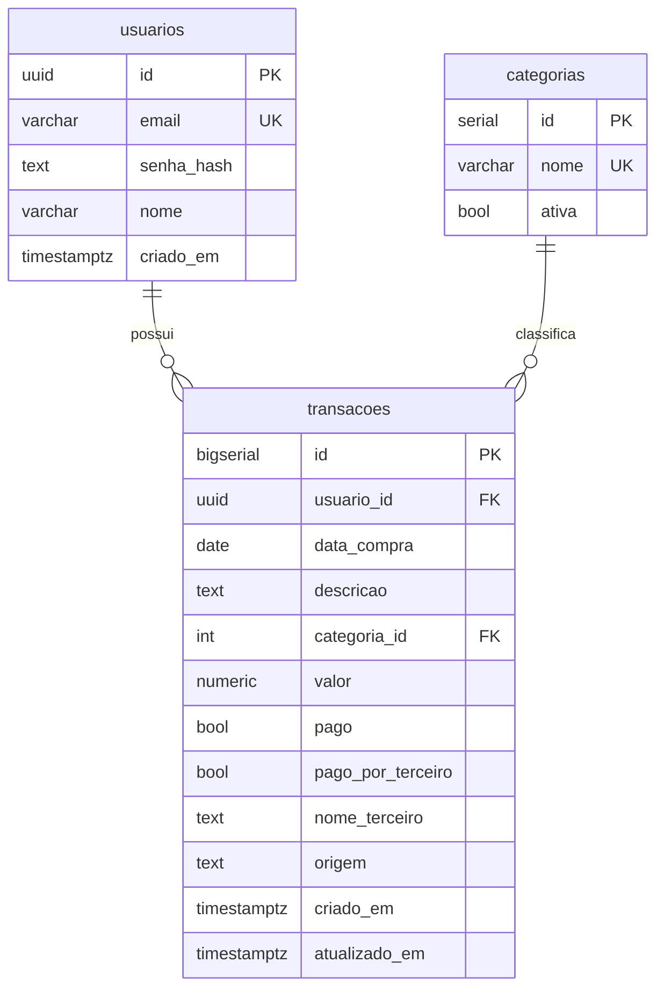

# Documentação — Fase 1: Banco de dados mínimo

Esta fase criou o schema essencial do MVP: tabelas `usuarios`, `categorias` e `transacoes`, com seed de categorias e um runner para aplicar migrations SQL numeradas.

---

## Objetivo da fase

Entregar um banco pronto para as próximas fases (login, cadastro de gastos, importação):

1. Rodar `python migrate.py` cria todas as tabelas do zero
2. Seed de categorias populado com 11 categorias padrão
3. Reexecução idempotente (migrations já aplicadas são ignoradas)
4. Regra de ouro documentada: toda query em `transacoes` filtra por `usuario_id`

---

## Estrutura criada

```
financas-platform/
├── app/
│   ├── sql/
│   │   ├── 001_usuarios.sql
│   │   ├── 002_categorias.sql
│   │   ├── 003_transacoes.sql
│   │   └── 004_seed_categorias.sql
│   └── servicos/
│       └── migrations.py    # Runner de migrations
├── migrate.py               # Entry point
├── pytest.ini               # Marker integration
├── tests/
│   └── test_migrations.py
└── docs/
    └── fase-1.md            # Este arquivo
```

---

## Modelo de dados



### `usuarios`

| Coluna | Tipo | Observação |
|--------|------|------------|
| `id` | UUID | PK, `gen_random_uuid()` |
| `email` | VARCHAR(255) | UNIQUE, NOT NULL |
| `senha_hash` | TEXT | Hash bcrypt (Fase 2) |
| `nome` | VARCHAR(255) | NOT NULL |
| `criado_em` | TIMESTAMPTZ | DEFAULT NOW() |

### `categorias`

| Coluna | Tipo | Observação |
|--------|------|------------|
| `id` | SERIAL | PK |
| `nome` | VARCHAR(100) | UNIQUE, NOT NULL |
| `ativa` | BOOLEAN | DEFAULT TRUE |

### `transacoes`

| Coluna | Tipo | Observação |
|--------|------|------------|
| `id` | BIGSERIAL | PK |
| `usuario_id` | UUID | FK → usuarios, ON DELETE CASCADE |
| `data_compra` | DATE | NOT NULL |
| `descricao` | TEXT | NOT NULL |
| `categoria_id` | INTEGER | FK → categorias, ON DELETE RESTRICT |
| `valor` | NUMERIC(12,2) | NOT NULL |
| `pago` | BOOLEAN | DEFAULT FALSE |
| `pago_por_terceiro` | BOOLEAN | DEFAULT FALSE |
| `nome_terceiro` | TEXT | Nullable |
| `origem` | TEXT | CHECK: `'manual'` ou `'importacao'` |
| `criado_em` | TIMESTAMPTZ | DEFAULT NOW() |
| `atualizado_em` | TIMESTAMPTZ | DEFAULT NOW() |

**Índices:**

- `idx_transacoes_usuario_id` em `(usuario_id)`
- `idx_transacoes_usuario_data` em `(usuario_id, data_compra DESC)`

### Regra de ouro

> Toda query em `transacoes` **sempre** deve filtrar por `usuario_id`. Isso garante isolamento entre usuários e está documentado no topo de `003_transacoes.sql`.

---

## Migrations

### Arquivos SQL

| Arquivo | Conteúdo |
|---------|----------|
| `001_usuarios.sql` | Tabela de usuários |
| `002_categorias.sql` | Tabela de categorias |
| `003_transacoes.sql` | Tabela de transações + índices |
| `004_seed_categorias.sql` | 11 categorias padrão |

### Runner (`app/servicos/migrations.py`)

1. Cria tabela de controle `schema_migrations` (via Python, não como `.sql`)
2. Lista arquivos `app/sql/*.sql` em ordem alfabética
3. Executa apenas migrations ainda não registradas, cada uma em transação
4. Registra versão aplicada (nome do arquivo)

### Seed de categorias

11 categorias ativas, inseridas com `ON CONFLICT (nome) DO NOTHING`:

1. Alimentação
2. Transporte
3. Moradia
4. Saúde
5. Educação
6. Lazer
7. Vestuário
8. Compras
9. Serviços
10. Investimentos
11. Outros

---

## Como rodar

```powershell
cd C:\Users\tcarmo\Documents\projeto\financas-platform

# 1. Banco (se ainda não estiver rodando)
docker compose up -d

# 2. Aplicar migrations
python migrate.py

# Saída esperada (primeira execução):
# Aplicada: 001_usuarios.sql
# Aplicada: 002_categorias.sql
# Aplicada: 003_transacoes.sql
# Aplicada: 004_seed_categorias.sql

# 3. Reexecução (idempotente)
python migrate.py
# Saída: Nenhuma migration pendente.
```

### Validar manualmente

```powershell
# Via psql no container
docker exec -it financas_db psql -U financas -d financas_db -c "SELECT count(*) FROM categorias;"
# Esperado: 11

docker exec -it financas_db psql -U financas -d financas_db -c "\dt"
# Esperado: usuarios, categorias, transacoes, schema_migrations
```

---

## Testes

```powershell
# Unitários (não exigem Postgres)
pytest tests/test_health.py

# Integração (exige docker compose up)
pytest -m integration
```

O teste de integração verifica:

- Tabelas existem
- 11 categorias ativas no seed
- FKs de `transacoes` para `usuarios` e `categorias`
- Índice `idx_transacoes_usuario_id` existe
- Reexecução de migrations é idempotente

---

## O que ficou de fora (propositalmente)

- Tabelas `resumo_mensal` e `orcamentos` (Parte 2)
- Login, cadastro de gastos, upload de planilha
- Triggers de `atualizado_em` (a app atualizará na Fase 3)
- Rotas Flask para o schema

---

## Commit sugerido

```
feat: schema mínimo do banco (usuarios, categorias, transacoes)
```

---

## Próximo passo

A **Fase 2** deve adicionar autenticação (registro, login, sessão com cookie) usando a tabela `usuarios`.
