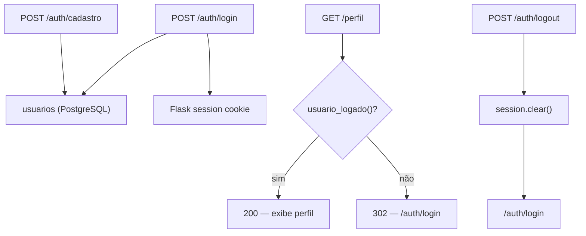

# Documentação — Fase 2: Autenticação simples

Esta fase adicionou cadastro, login, logout e sessão com cookie Flask, usando a tabela `usuarios` criada na Fase 1.

---

## Objetivo da fase

Entregar autenticação mínima para proteger rotas futuras:

1. `POST /auth/cadastro` + tela HTML de cadastro
2. `POST /auth/login` (cria sessão) + tela HTML de login
3. `POST /auth/logout`
4. Função `usuario_logado()` usada em rotas protegidas

**Critério de aceite:** dá pra cadastrar, logar, deslogar, e uma rota protegida só funciona logado.

---

## Estrutura criada

```
financas-platform/
├── app/
│   ├── rotas/
│   │   ├── auth.py          # Cadastro, login, logout
│   │   └── perfil.py        # Rota protegida de demonstração
│   ├── servicos/
│   │   ├── auth.py          # usuario_logado(), sessão
│   │   └── usuarios.py      # CRUD de usuários + bcrypt
│   └── templates/
│       ├── base.html
│       ├── perfil.html
│       └── auth/
│           ├── cadastro.html
│           └── login.html
├── tests/
│   ├── test_auth.py
│   └── test_auth_integration.py
└── docs/
    └── fase-2.md            # Este arquivo
```

---

## Fluxo de autenticação



---

## Endpoints

| Método | Rota | Descrição |
|--------|------|-----------|
| GET | `/auth/cadastro` | Formulário de cadastro |
| POST | `/auth/cadastro` | Cria usuário (senha com bcrypt) |
| GET | `/auth/login` | Formulário de login |
| POST | `/auth/login` | Valida credenciais e cria sessão |
| POST | `/auth/logout` | Encerra sessão |
| GET | `/perfil` | Rota protegida (requer login) |

### Sessão

Após login bem-sucedido, a sessão Flask armazena:

- `usuario_id` — UUID do usuário
- `usuario_nome` — nome exibido
- `usuario_email` — email do usuário

A sessão é assinada com `SECRET_KEY` (definida em `.env`).

### `usuario_logado()`

Função central em `app/servicos/auth.py`. Retorna `dict` com dados do usuário ou `None` se não houver sessão. Toda rota protegida deve chamá-la no início:

```python
usuario = usuario_logado()
if not usuario:
    return redirect(url_for("auth.login"))
```

---

## Como rodar

```powershell
cd C:\Users\tcarmo\Documents\projeto\financas-platform

# 1. Banco (se ainda não estiver rodando)
docker compose up -d

# 2. Migrations (se ainda não aplicadas)
python migrate.py

# 3. App
python run.py
```

### Validar manualmente no browser

1. Abrir `http://localhost:5000/auth/cadastro` → cadastrar usuário
2. Abrir `http://localhost:5000/auth/login` → logar
3. Acessar `http://localhost:5000/perfil` → deve mostrar nome e email
4. Clicar **Sair** → redirect para login
5. Tentar `http://localhost:5000/perfil` novamente → redirect para login

### Exemplos com curl

```powershell
# Cadastro
curl -X POST http://localhost:5000/auth/cadastro `
  -d "nome=João&email=joao@example.com&senha=senha123" `
  -c cookies.txt -L

# Login (salva cookie de sessão)
curl -X POST http://localhost:5000/auth/login `
  -d "email=joao@example.com&senha=senha123" `
  -c cookies.txt -b cookies.txt -L

# Perfil (com cookie)
curl http://localhost:5000/perfil -b cookies.txt

# Logout
curl -X POST http://localhost:5000/auth/logout -b cookies.txt -c cookies.txt -L
```

---

## Testes

```powershell
# Unitários (não exigem Postgres)
pytest tests/test_health.py tests/test_auth.py

# Integração (exige docker compose up)
pytest -m integration
```

O teste de integração verifica o fluxo completo:

- Cadastro → login → `/perfil` acessível → logout → `/perfil` bloqueado
- Email duplicado no cadastro retorna erro

---

## Validações

| Campo | Regra |
|-------|-------|
| Nome | Obrigatório |
| Email | Obrigatório, deve conter `@`, único no banco |
| Senha | Mínimo 6 caracteres |

Credenciais inválidas no login exibem mensagem genérica ("Email ou senha incorretos").

---

## O que ficou de fora (propositalmente)

- Recuperação de senha e "lembrar-me"
- CSRF protection (Flask-WTF)
- JWT ou tokens de API
- Middleware global `before_request`
- Cadastro de gastos e upload de planilha (Fase 3+)

---

## Commit sugerido

```
feat: autenticação simples (cadastro, login, logout, sessão)
```

---

## Próximo passo

A **Fase 3** deve adicionar cadastro de gastos (CRUD de transações), sempre filtrando por `usuario_id` da sessão.
