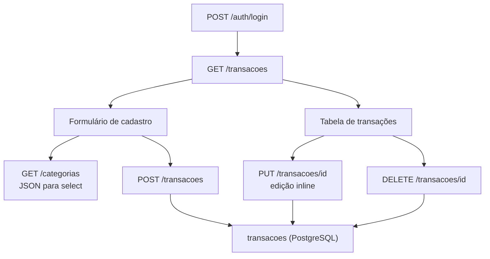

# Documentação — Fase 3: Frontend básico — cadastro manual de transação

Esta fase adicionou a primeira tela real do sistema: formulário de gastos, listagem em tabela, edição inline e exclusão, com persistência no PostgreSQL.

---

## Objetivo da fase

Entregar CRUD manual de transações para usuários autenticados:

1. Tela HTML com formulário: data, descrição, categoria, valor, pago, pago por terceiro
2. `GET /categorias` — JSON para popular o select
3. `POST /transacoes` — cadastro de gasto
4. `GET /transacoes` — listagem em tabela
5. `PUT /transacoes/<id>` — edição inline
6. `DELETE /transacoes/<id>` — exclusão

**Critério de aceite:** usuário loga, cadastra um gasto pelo formulário, vê na lista, edita e apaga. Tudo salvo no Postgres.

---

## Estrutura criada

```
financas-platform/
├── app/
│   ├── rotas/
│   │   ├── categorias.py    # GET /categorias (JSON)
│   │   └── transacoes.py    # CRUD + tela principal
│   ├── servicos/
│   │   ├── categorias.py    # listar_ativas()
│   │   └── transacoes.py    # CRUD com filtro usuario_id
│   └── templates/
│       └── transacoes/
│           └── listar.html    # Form + tabela + edição inline
├── tests/
│   ├── test_transacoes.py
│   └── test_transacoes_integration.py
└── docs/
    └── fase-3.md            # Este arquivo
```

---

## Fluxo



---

## Endpoints

| Método | Rota | Descrição |
|--------|------|-----------|
| GET | `/categorias` | Lista categorias ativas em JSON `[{id, nome}]` |
| GET | `/transacoes` | Tela com formulário + tabela (protegida) |
| POST | `/transacoes` | Cria transação com `origem='manual'` |
| PUT | `/transacoes/<id>` | Atualiza transação do usuário logado |
| DELETE | `/transacoes/<id>` | Exclui transação do usuário logado |

Todas as rotas exigem sessão ativa (`usuario_logado()`). Sem login → redirect para `/auth/login` (HTML) ou `401` (JSON).

Após login, o usuário é redirecionado para `/transacoes`.

### Regra de ouro

Toda query em `transacoes` filtra por `usuario_id` da sessão. O ID nunca vem do body da request.

---

## Como rodar

```powershell
cd C:\Users\tcarmo\Documents\projeto\financas-platform

docker compose up -d
python migrate.py
python run.py
```

### Validar manualmente no browser

1. Login em `http://localhost:5000/auth/login`
2. Redirecionado para `/transacoes`
3. Preencher formulário (ex.: Alimentação, R$ 45,90) → **Salvar**
4. Gasto aparece na tabela
5. Clicar **Editar** na linha → alterar descrição → **Salvar**
6. Clicar **Excluir** → confirmar → linha removida
7. Recarregar a página → dados persistem (ou lista vazia após exclusão)

### Exemplos com curl

```powershell
# Login
curl -X POST http://localhost:5000/auth/login `
  -d "email=joao@example.com&senha=senha123" `
  -c cookies.txt -b cookies.txt -L

# Listar categorias
curl http://localhost:5000/categorias -b cookies.txt

# Criar transação
curl -X POST http://localhost:5000/transacoes `
  -d "data_compra=2026-07-13&descricao=Almoco&categoria_id=1&valor=45.90&pago=true" `
  -b cookies.txt -c cookies.txt -L

# Atualizar (id=1)
curl -X PUT http://localhost:5000/transacoes/1 `
  -d "data_compra=2026-07-13&descricao=Jantar&categoria_id=1&valor=60.00" `
  -b cookies.txt -H "Accept: application/json"

# Excluir (id=1)
curl -X DELETE http://localhost:5000/transacoes/1 `
  -b cookies.txt -H "Accept: application/json"
```

---

## Testes

```powershell
# Unitários (não exigem Postgres)
pytest tests/test_health.py tests/test_auth.py tests/test_transacoes.py

# Integração (exige docker compose up)
pytest -m integration
```

O teste de integração verifica:

- Fluxo completo: cadastro → login → POST → listagem → PUT → DELETE
- Isolamento: usuário B não consegue editar/excluir transação do usuário A

---

## Validações

| Campo | Regra |
|-------|-------|
| `data_compra` | Obrigatório, formato `YYYY-MM-DD` |
| `descricao` | Obrigatório |
| `categoria_id` | Inteiro, categoria ativa existente |
| `valor` | Numérico > 0 |
| `pago` | Boolean (checkbox) |
| `pago_por_terceiro` | Boolean; se true → `nome_terceiro` obrigatório |

---

## O que ficou de fora (propositalmente)

- Importação de planilha (`origem='importacao'`)
- Filtros por data/categoria
- Paginação
- CSRF protection

---

## Commit sugerido

```
feat: CRUD de transações e listagem de categorias
```

---

## Próximo passo

A **Fase 4** pode adicionar importação de planilhas ou filtros na listagem de transações.
