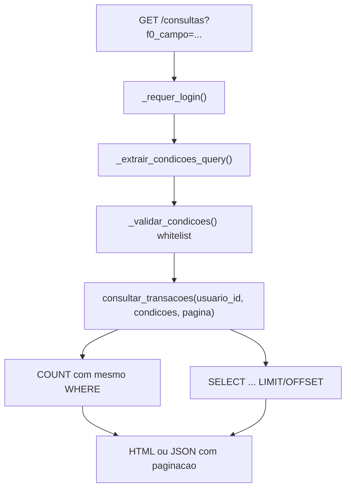

# Documentação — Fase 10: Consultas personalizadas

Esta fase adicionou uma tela de consultas com construtor de filtros dinâmicos, backend com WHERE parametrizado e paginação.

---

## Objetivo da fase

Entregar consultas personalizadas para usuários autenticados:

1. Tela com construtor de filtros (campo, operador, valor)
2. Backend monta `WHERE` parametrizado, sempre travado no `usuario_id` da sessão
3. Paginação e limite de condições combinadas

**Critério de aceite:** usuário combina 2–3 filtros e vê o resultado, sem risco de SQL arbitrário ou vazamento entre usuários.

---

## Estrutura alterada

```
financas-platform/
├── app/
│   ├── rotas/
│   │   └── consultas.py             # GET /consultas (HTML + JSON)
│   ├── servicos/
│   │   └── consultas.py             # Query builder seguro + paginação
│   └── templates/
│       └── consultas/
│           └── listar.html          # Construtor de filtros dinâmico
├── tests/
│   ├── test_consultas.py
│   └── test_consultas_integration.py
└── docs/
    └── fase-10.md                   # Este arquivo
```

---

## Fluxo



---

## Campos e operadores permitidos

| Campo | Operadores | Comportamento |
|-------|------------|---------------|
| `categoria` | `igual`, `contem` | Igual = `categoria_id`; Contém = `c.nome ILIKE %texto%` |
| `data_compra` | `igual`, `maior_que`, `menor_que`, `entre` | Datas em `YYYY-MM-DD` |
| `valor` | `igual`, `maior_que`, `menor_que`, `entre` | Numérico |
| `pago` | `igual` | `true` / `false` |
| `pago_por_terceiro` | `igual` | `true` / `false` |

- Máximo de **5** condições combinadas (AND)
- Zero condições = todas as transações do usuário (paginadas)

---

## Query params

### Paginação

| Param | Default | Limite |
|-------|---------|--------|
| `pagina` | 1 | >= 1 |
| `por_pagina` | 25 | 1–100 |

### Condições (indexadas)

| Param | Exemplo |
|-------|---------|
| `f0_campo` | `valor` |
| `f0_operador` | `maior_que` |
| `f0_valor` | `100` |
| `f0_valor2` | `500` (só para `entre`) |

Exemplo:

```
GET /consultas?f0_campo=valor&f0_operador=maior_que&f0_valor=100&f1_campo=pago&f1_operador=igual&f1_valor=false&pagina=1
```

---

## Endpoints

| Método | Rota | Descrição |
|--------|------|-----------|
| GET | `/consultas` | Tela HTML com construtor de filtros |
| GET | `/consultas?f0_campo=...` | JSON (se `Accept: application/json`) |

Todas as rotas exigem sessão ativa.

### Regra de ouro

Toda query em `transacoes` filtra por `usuario_id` da sessão. Campo e operador vêm de **whitelist fixa** — valores do usuário entram apenas como parâmetros `%s` (psycopg2), nunca interpolados no SQL.

---

## Como rodar

```powershell
cd C:\Users\tcarmo\Documents\projeto\financas-platform

docker compose up -d
python migrate.py
python run.py
```

### Validar manualmente no browser

1. Login em `http://localhost:5000/auth/login`
2. Acesse **Consultas** no menu ou `http://localhost:5000/consultas`
3. Adicione 2–3 filtros (ex.: valor maior que 100 + pago = Não)
4. Clique **Consultar** e verifique a tabela de resultados
5. Teste paginação se houver muitas transações

### Exemplos com curl

```powershell
# Login
curl -X POST http://localhost:5000/auth/login `
  -d "email=joao@example.com&senha=senha123" `
  -c cookies.txt -b cookies.txt -L

# Consulta combinada (JSON)
curl "http://localhost:5000/consultas?f0_campo=valor&f0_operador=maior_que&f0_valor=100&f1_campo=pago&f1_operador=igual&f1_valor=false" `
  -H "Accept: application/json" -b cookies.txt
```

---

## Testes

```powershell
# Unitários (não exigem Postgres)
pytest tests/test_consultas.py

# Integração (exige docker compose up)
pytest -m integration tests/test_consultas_integration.py
```

---

## O que ficou de fora (propositalmente)

- Filtro por `descricao` ou `origem`
- Persistência de consultas salvas / favoritas
- Exportação CSV dos resultados
- Alteração dos filtros fixos da tela `/transacoes` (Fase 7)

---

## Commit sugerido

```
feat: consultas personalizadas com filtros dinâmicos (Fase 10)
```

---

## Próximo passo

Fases futuras podem incluir tela HTML do dashboard, exportação filtrada ou consultas salvas.
