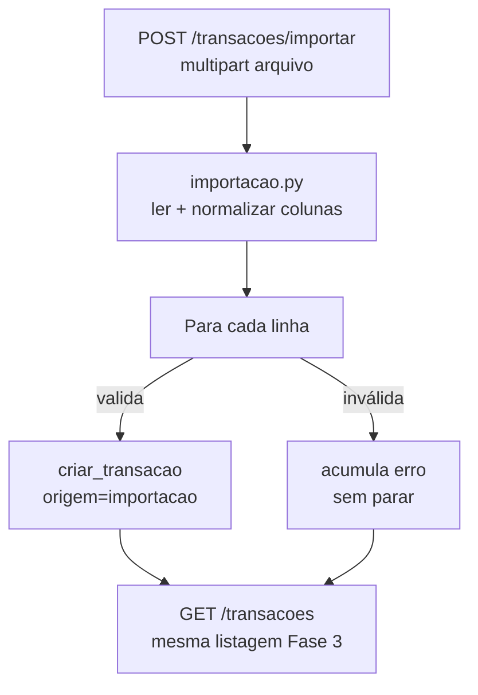
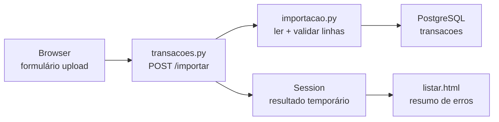

# Documentação — Fase 4: Upload de planilha

Esta fase adicionou a segunda forma de entrada de dados: importação de planilhas CSV ou Excel com formato fixo, com limpeza básica linha a linha e resumo do resultado na tela.

---

## Objetivo da fase

Entregar upload de planilha para usuários autenticados:

1. Tela HTML com input de arquivo (`.xlsx`/`.csv`) e botão **Importar**
2. `POST /transacoes/importar` processando um único formato conhecido
3. Serviço de limpeza em `app/servicos/importacao.py`
4. Resumo pós-upload: linhas importadas, linhas com erro, transações visíveis na listagem

**Critério de aceite:** usuário sobe uma planilha real, vê o resultado do import, e as transações aparecem na lista junto com as cadastradas manualmente.

---

## Estrutura criada/alterada

```
financas-platform/
├── app/
│   ├── rotas/
│   │   └── transacoes.py         # + POST /transacoes/importar
│   ├── servicos/
│   │   ├── importacao.py         # leitura, normalização, importação
│   │   ├── categorias.py         # + mapa_nome_para_id()
│   │   └── transacoes.py         # criar_transacao(origem=...)
│   └── templates/
│       └── transacoes/
│           └── listar.html       # + seção de upload e resumo
├── tests/
│   ├── fixtures/
│   │   └── planilha_exemplo.csv
│   ├── test_importacao.py
│   └── test_importacao_integration.py
└── docs/
    └── fase-4.md                 # Este arquivo
```

---

## Formato da planilha

Primeira linha = cabeçalho. Colunas canônicas (aliases aceitos após normalização):

| Coluna | Obrigatória | Aliases | Exemplo |
|--------|-------------|---------|---------|
| `data` | sim | data_compra, data compra | `2026-07-13` ou `13/07/2026` |
| `descricao` | sim | descrição, desc | `Supermercado` |
| `categoria` | sim | categoria_nome | `Alimentação` |
| `valor` | sim | valor, amount | `45,90` ou `45.90` |
| `pago` | não | pago, pago? | `sim`, `true`, `1` |
| `pago_por_terceiro` | não | pago por terceiro | `não` |
| `nome_terceiro` | condicional | nome terceiro | `Maria` |

Categorias são resolvidas **por nome** contra as categorias ativas do seed (match case-insensitive, sem acento).

---

## Fluxo



---

## Endpoints

| Método | Rota | Descrição |
|--------|------|-----------|
| POST | `/transacoes/importar` | Upload de `.csv` ou `.xlsx` (protegida) |

**Request:** `multipart/form-data` com campo `arquivo`.

**Comportamento:**
- Linhas válidas → inseridas com `origem='importacao'`
- Linhas inválidas → registradas em `erros[]`, importação continua
- Resultado armazenado na sessão e exibido na próxima visita a `/transacoes`

---

## Como rodar

```powershell
cd C:\Users\tcarmo\Documents\projeto\financas-platform

docker compose up -d
python migrate.py
python run.py
```

### Validar manualmente no browser

1. Login em `http://localhost:5000/auth/login`
2. Cadastrar um gasto manual na seção **Novo gasto**
3. Na seção **Importar planilha**, selecionar `tests/fixtures/planilha_exemplo.csv`
4. Clicar **Importar**
5. Ver resumo: 2 importadas, 1 com erro (linha sem descrição)
6. Confirmar que Supermercado, Uber e o gasto manual aparecem na tabela

### Exemplo com curl

```powershell
curl -X POST http://localhost:5000/transacoes/importar `
  -b cookies.txt -c cookies.txt `
  -F "arquivo=@tests/fixtures/planilha_exemplo.csv" `
  -L
```

---

## Testes

```powershell
# Unitários (não exigem Postgres)
pytest tests/test_health.py tests/test_auth.py tests/test_transacoes.py tests/test_importacao.py

# Integração (exige docker compose up)
pytest -m integration
```

O teste de integração verifica:

- Cadastro manual + upload de planilha
- 2 transações importadas, 1 linha com erro
- `origem='importacao'` no Postgres

---

## Guia do código para iniciantes

Se você está aprendendo, leia os arquivos nesta ordem:

1. [`app/templates/transacoes/listar.html`](../app/templates/transacoes/listar.html) — formulário de upload na tela
2. [`app/rotas/transacoes.py`](../app/rotas/transacoes.py) — rota `importar()` recebe o arquivo
3. [`app/servicos/importacao.py`](../app/servicos/importacao.py) — lógica de leitura e validação

### Fluxo simplificado



### Quem faz o quê

| Arquivo | Responsabilidade |
|---------|------------------|
| `listar.html` | Mostra o formulário de upload e o resumo (importadas / erros) |
| `rotas/transacoes.py` | Recebe o arquivo, chama o serviço, guarda resultado na session |
| `servicos/importacao.py` | Lê CSV/XLSX, normaliza colunas, valida cada linha, salva no banco |
| `servicos/categorias.py` | `mapa_nome_para_id()` — traduz "Alimentação" → id da categoria |
| `servicos/transacoes.py` | `criar_transacao(origem='importacao')` — INSERT no Postgres |

### Exemplo: uma linha da planilha

Planilha:

```
data,descricao,categoria,valor
2026-07-10,Supermercado,Alimentação,125.50
```

Passo a passo:

1. **`ler_planilha`** — pandas lê o CSV em um DataFrame
2. **`_mapear_colunas`** — confirma que existem data, descricao, categoria, valor
3. **`_validar_linha`** — converte "125.50" → Decimal, "Alimentação" → categoria_id
4. **`criar_transacao`** — INSERT com `origem='importacao'`
5. Se a linha seguinte tiver erro (ex.: descrição vazia), entra em `erros[]` mas as anteriores já foram salvas

---

## O que ficou de fora (propositalmente)

- Perfis de importação (Fase 8)
- Mapeamento configurável de colunas
- Preview antes de confirmar
- Deduplicação

---

## Commit sugerido

```
feat: importação de planilha CSV/XLSX com formato fixo
```

---

## Próximo passo

A **Parte 2** pode incluir filtros na listagem, dashboard ou perfis de importação, dependendo do feedback do MVP.
