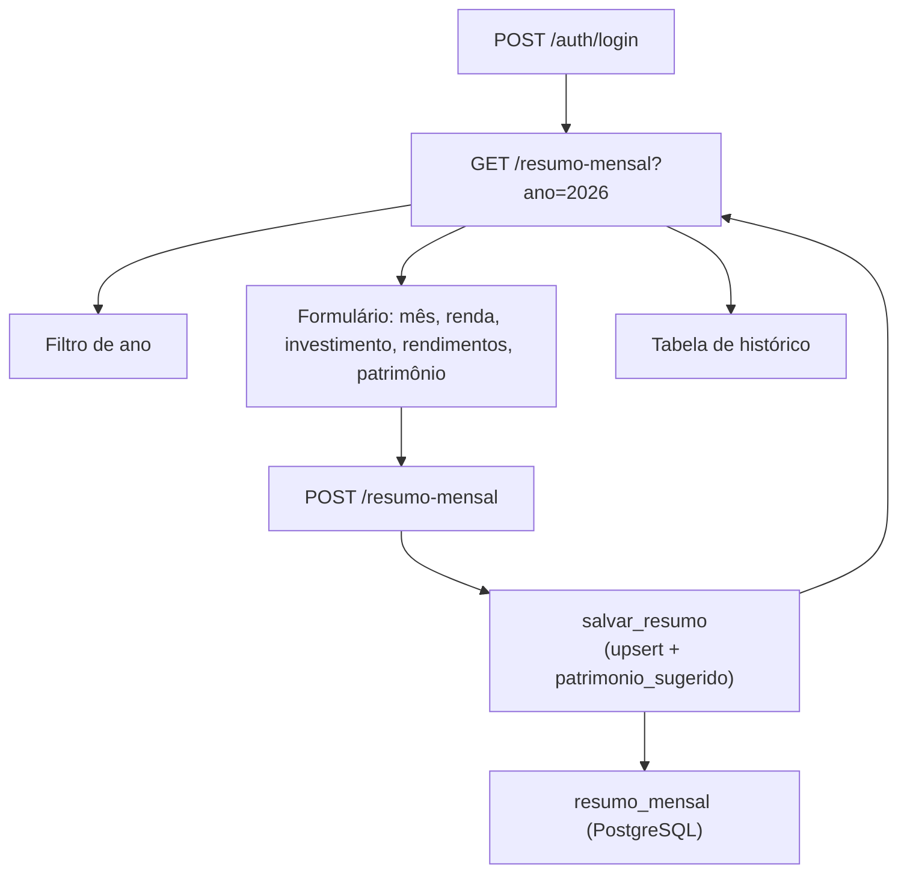

# Documentação — Fase 5: Dados mensais (resumo_mensal)

Esta fase adicionou o registro mensal de renda, investimento, rendimentos e patrimônio, com histórico por ano e cálculo automático de patrimônio sugerido.

---

## Objetivo da fase

Entregar resumo mensal para usuários autenticados:

1. Tabela `resumo_mensal` no PostgreSQL (migration `005_resumo_mensal.sql`)
2. `POST /resumo-mensal` — cria ou atualiza por `usuario_id + ano_mes` (upsert)
3. `GET /resumo-mensal?ano=2026` — tela HTML ou JSON listando os meses do ano
4. Cálculo automático de `patrimonio_sugerido`, sem sobrescrever o valor manual

**Critério de aceite:** usuário registra dados do mês e consulta o histórico.

---

## Estrutura criada

```
financas-platform/
├── app/
│   ├── sql/
│   │   └── 005_resumo_mensal.sql       # Tabela + índice + UNIQUE
│   ├── rotas/
│   │   └── resumo_mensal.py            # GET + POST
│   ├── servicos/
│   │   └── resumo_mensal.py            # Upsert, cálculo, listagem
│   └── templates/
│       └── resumo_mensal/
│           └── listar.html             # Form + filtro de ano + tabela
├── tests/
│   ├── test_resumo_mensal.py
│   └── test_resumo_mensal_integration.py
└── docs/
    └── fase-5.md                       # Este arquivo
```

---

## Fluxo



---

## Endpoints

| Método | Rota | Descrição |
|--------|------|-----------|
| GET | `/resumo-mensal?ano=2026` | Tela HTML com form + tabela (protegida) |
| GET | `/resumo-mensal?ano=2026` | JSON array (se `Accept: application/json`) |
| POST | `/resumo-mensal` | Cria ou atualiza resumo do mês (upsert) |

Todas as rotas exigem sessão ativa. Sem login → redirect para `/auth/login` (HTML) ou `401` (JSON).

### Regra de ouro

Toda query em `resumo_mensal` filtra por `usuario_id` da sessão. O ID nunca vem do body da request.

---

## Tabela `resumo_mensal`

| Coluna | Tipo | Descrição |
|--------|------|-----------|
| `id` | BIGSERIAL | Chave primária |
| `usuario_id` | UUID | FK para `usuarios` |
| `ano_mes` | TEXT | Formato `"2026-07"` |
| `renda` | NUMERIC | Renda do mês (histórico) |
| `investimento` | NUMERIC | Valor investido/aportado |
| `rendimentos` | NUMERIC | Juros, dividendos etc. |
| `patrimonio` | NUMERIC (nullable) | Valor manual informado pelo usuário |
| `patrimonio_sugerido` | NUMERIC | Calculado automaticamente |
| `UNIQUE (usuario_id, ano_mes)` | — | Permite upsert seguro |

---

## Fórmula do patrimônio sugerido

```
1. Busca o registro do mês anterior (ex: 2026-02 para 2026-03)
2. base = patrimonio manual do mês anterior, se existir;
          senão patrimonio_sugerido do mês anterior;
          senão 0
3. patrimonio_sugerido = base + investimento + rendimentos
```

- A **renda** não entra no cálculo nesta fase (fica só para histórico)
- O **patrimonio manual** nunca é sobrescrito pelo cálculo
- No upsert, se `patrimonio` vier vazio, mantém o valor já salvo

---

## Como rodar

```powershell
cd C:\Users\tcarmo\Documents\projeto\financas-platform

docker compose up -d
python migrate.py
python run.py
```

### Validar manualmente no browser

1. Login em `http://localhost:5000/auth/login`
2. Acesse **Resumo mensal** no menu ou `http://localhost:5000/resumo-mensal?ano=2026`
3. Preencha o formulário (ex.: jul/2026, renda 5000, investimento 1000, rendimentos 100)
4. Clique **Salvar mês** → registro aparece na tabela
5. Reenvie o mesmo mês com valores diferentes → atualiza (não duplica)
6. Coluna **Patrimônio sugerido** preenchida automaticamente
7. Troque o ano no filtro → lista só aquele ano

### Exemplos com curl

```powershell
# Login
curl -X POST http://localhost:5000/auth/login `
  -d "email=joao@example.com&senha=senha123" `
  -c cookies.txt -b cookies.txt -L

# Listar resumos de 2026 (JSON)
curl "http://localhost:5000/resumo-mensal?ano=2026" `
  -H "Accept: application/json" -b cookies.txt

# Salvar/atualizar mês
curl -X POST http://localhost:5000/resumo-mensal `
  -d "ano_mes=2026-07&renda=5000&investimento=1000&rendimentos=100" `
  -b cookies.txt -c cookies.txt -L
```

---

## Testes

```powershell
# Unitários (não exigem Postgres)
pytest tests/test_resumo_mensal.py

# Integração (exige docker compose up)
pytest -m integration tests/test_resumo_mensal_integration.py tests/test_migrations.py
```

---

## O que ficou de fora (propositalmente)

- Uso da renda no cálculo de patrimônio (fases futuras)
- Recálculo em cascata de meses posteriores ao editar um mês antigo
- Dashboard ou gráficos
- Integração com transações/gastos do mês

---

## Commit sugerido

```
feat: resumo mensal com upsert e patrimonio sugerido (Fase 5)
```

---

## Próximo passo

Fases futuras da Parte 2 podem incluir orçamentos, dashboard e filtros avançados.
