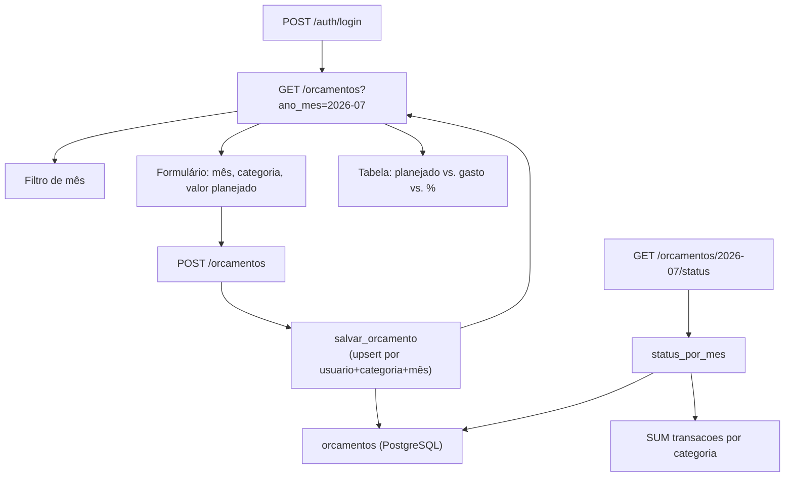

# Documentação — Fase 6: Orçamentos por categoria

Esta fase adicionou orçamentos mensais por categoria, com comparação entre valor planejado e gasto real das transações.

---

## Objetivo da fase

Entregar orçamentos por categoria para usuários autenticados:

1. Tabela `orcamentos` no PostgreSQL (migration `006_orcamentos.sql`)
2. `POST /orcamentos` — cria ou atualiza por `usuario_id + categoria_id + ano_mes` (upsert)
3. `GET /orcamentos/<ano_mes>/status` — compara planejado vs. gasto real, com percentual usado
4. Tela HTML com formulário e tabela de status

**Critério de aceite:** orçamento criado e comparado corretamente com gastos reais.

---

## Estrutura criada

```
financas-platform/
├── app/
│   ├── sql/
│   │   └── 006_orcamentos.sql          # Tabela + índice + UNIQUE
│   ├── rotas/
│   │   └── orcamentos.py               # GET + POST + GET status
│   ├── servicos/
│   │   └── orcamentos.py               # Upsert, status, cálculo de %
│   └── templates/
│       └── orcamentos/
│           └── listar.html             # Form + filtro de mês + tabela
├── tests/
│   ├── test_orcamentos.py
│   └── test_orcamentos_integration.py
└── docs/
    └── fase-6.md                       # Este arquivo
```

---

## Fluxo



---

## Endpoints

| Método | Rota | Descrição |
|--------|------|-----------|
| GET | `/orcamentos?ano_mes=2026-07` | Tela HTML com form + tabela de status (protegida) |
| POST | `/orcamentos` | Cria ou atualiza orçamento (upsert) |
| GET | `/orcamentos/<ano_mes>/status` | JSON com planejado vs. gasto (se `Accept: application/json`) |

Todas as rotas exigem sessão ativa. Sem login → redirect para `/auth/login` (HTML) ou `401` (JSON).

### Regra de ouro

Toda query em `orcamentos` filtra por `usuario_id` da sessão. O ID nunca vem do body da request.

---

## Tabela `orcamentos`

| Coluna | Tipo | Descrição |
|--------|------|-----------|
| `id` | BIGSERIAL | Chave primária |
| `usuario_id` | UUID | FK para `usuarios` |
| `categoria_id` | INTEGER | FK para `categorias` |
| `ano_mes` | TEXT | Formato `"2026-07"` |
| `valor_planejado` | NUMERIC | Limite de gasto planejado |
| `UNIQUE (usuario_id, categoria_id, ano_mes)` | — | Permite upsert seguro |

---

## Cálculo do gasto real e percentual

```
1. Busca orçamentos do usuário no mês (JOIN categorias para nome)
2. Soma transações por categoria:
   SELECT categoria_id, SUM(valor)
   FROM transacoes
   WHERE usuario_id = X AND TO_CHAR(data_compra, 'YYYY-MM') = ano_mes
3. Para cada orçamento:
   - valor_gasto = soma das transações da categoria (0 se não houver)
   - saldo_restante = valor_planejado - valor_gasto
   - percentual_usado = (valor_gasto / valor_planejado) * 100
   - Se valor_planejado = 0 → percentual_usado = null
```

- **Gasto real:** todas as transações do mês (por `data_compra`), sem filtrar `pago` ou `pago_por_terceiro`
- **Saldo negativo:** indica que o orçamento foi estourado

---

## Como rodar

```powershell
cd C:\Users\tcarmo\Documents\projeto\financas-platform

docker compose up -d
python migrate.py
python run.py
```

### Validar manualmente no browser

1. Login em `http://localhost:5000/auth/login`
2. Acesse **Orçamentos** no menu ou `http://localhost:5000/orcamentos?ano_mes=2026-07`
3. Defina orçamento R$ 500 para "Alimentação" em jul/2026
4. Cadastre gasto R$ 150 em jul/2026 na mesma categoria em `/transacoes`
5. Volte em Orçamentos → tabela mostra 30% usado, saldo R$ 350
6. Reenvie o mesmo orçamento com valor diferente → atualiza (não duplica)

### Exemplos com curl

```powershell
# Login
curl -X POST http://localhost:5000/auth/login `
  -d "email=joao@example.com&senha=senha123" `
  -c cookies.txt -b cookies.txt -L

# Status do mês (JSON)
curl "http://localhost:5000/orcamentos/2026-07/status" `
  -H "Accept: application/json" -b cookies.txt

# Salvar/atualizar orçamento
curl -X POST http://localhost:5000/orcamentos `
  -d "ano_mes=2026-07&categoria_id=1&valor_planejado=500" `
  -b cookies.txt -c cookies.txt -L
```

---

## Testes

```powershell
# Unitários (não exigem Postgres)
pytest tests/test_orcamentos.py

# Integração (exige docker compose up)
pytest -m integration tests/test_orcamentos_integration.py tests/test_migrations.py
```

---

## O que ficou de fora (propositalmente)

- Alertas ou notificações quando orçamento estoura
- Orçamento global (soma de todas as categorias)
- Gráficos ou dashboard
- Categorias sem orçamento definido na tabela de status

---

## Commit sugerido

```
feat: orçamentos por categoria com status planejado vs. gasto (Fase 6)
```

---

## Próximo passo

Fases futuras podem incluir dashboard, alertas de orçamento estourado e filtros avançados.
