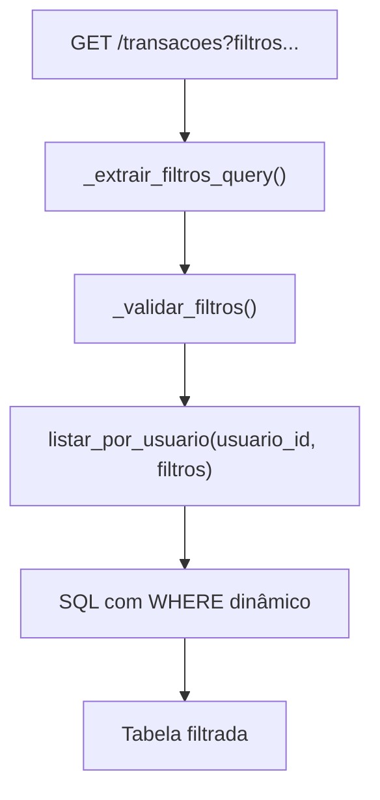

# Documentação — Fase 7: Filtros na listagem de transações

Esta fase adicionou filtros opcionais na tela de transações: intervalo de datas, categoria e status pago/não pago.

---

## Objetivo da fase

Entregar filtros na listagem para usuários autenticados:

1. `GET /transacoes` passa a aceitar query params de filtro
2. Formulário GET na tela existente (Fase 3)
3. Combinação de filtros com lógica AND

**Critério de aceite:** usuário filtra a lista de transações por qualquer combinação desses campos.

---

## Estrutura alterada

```
financas-platform/
├── app/
│   ├── rotas/
│   │   └── transacoes.py            # GET com filtros + validação
│   ├── servicos/
│   │   └── transacoes.py            # listar_por_usuario com WHERE dinâmico
│   └── templates/
│       └── transacoes/
│           └── listar.html          # Form GET de filtros
├── tests/
│   ├── test_transacoes.py           # Testes unitários de filtros
│   └── test_transacoes_integration.py
└── docs/
    └── fase-7.md                    # Este arquivo
```

---

## Fluxo



---

## Query params

| Param | Tipo | Comportamento |
|-------|------|---------------|
| `data_inicio` | `YYYY-MM-DD` | Opcional. `data_compra >= data_inicio` |
| `data_fim` | `YYYY-MM-DD` | Opcional. `data_compra <= data_fim` |
| `categoria_id` | int | Opcional. Filtra categoria exata |
| `pago` | `true` / `false` | Opcional. Vazio = todos |

Exemplo:

```
GET /transacoes?data_inicio=2026-07-01&data_fim=2026-07-31&categoria_id=1&pago=true
```

Filtros combinados usam **AND**. Campos vazios são ignorados.

---

## Endpoints

| Método | Rota | Descrição |
|--------|------|-----------|
| GET | `/transacoes` | Tela HTML (sem filtros = lista completa) |
| GET | `/transacoes?data_inicio=...&...` | Tela HTML filtrada |
| GET | `/transacoes?...` | JSON array (se `Accept: application/json`) |

Todas as rotas exigem sessão ativa.

### Regra de ouro

Toda query em `transacoes` filtra por `usuario_id` da sessão. Filtros nunca substituem esse critério.

---

## Como rodar

```powershell
cd C:\Users\tcarmo\Documents\projeto\financas-platform

docker compose up -d
python migrate.py
python run.py
```

### Validar manualmente no browser

1. Login em `http://localhost:5000/auth/login`
2. Cadastre transações em datas, categorias e status diferentes
3. Use o formulário **Filtrar transações** acima da tabela
4. Teste intervalo de datas, categoria e pago separadamente e em combinação
5. Clique **Limpar filtros** para voltar à lista completa

### Exemplos com curl

```powershell
# Login
curl -X POST http://localhost:5000/auth/login `
  -d "email=joao@example.com&senha=senha123" `
  -c cookies.txt -b cookies.txt -L

# Listar transações de jul/2026 pagas (JSON)
curl "http://localhost:5000/transacoes?data_inicio=2026-07-01&data_fim=2026-07-31&pago=true" `
  -H "Accept: application/json" -b cookies.txt
```

---

## Testes

```powershell
# Unitários (não exigem Postgres)
pytest tests/test_transacoes.py

# Integração (exige docker compose up)
pytest -m integration tests/test_transacoes_integration.py
```

---

## O que ficou de fora (propositalmente)

- Preservar filtros nos redirects de POST/import/edit/delete
- Filtro por pago_por_terceiro ou origem
- Paginação da listagem

---

## Commit sugerido

```
feat: filtros na listagem de transações (Fase 7)
```

---

## Próximo passo

Fases futuras podem incluir dashboard, paginação ou exportação filtrada.
