# Documentação — Fase 8: Import multi-formato (perfis de importação)

Esta fase evoluiu a importação da Fase 4 para aceitar planilhas de fontes diferentes, com perfis configuráveis em código, detecção automática por cabeçalho e seleção manual na tela de upload.

---

## Objetivo da fase

Entregar importação multi-formato para usuários autenticados:

1. Estrutura de perfis em `app/servicos/perfis_importacao/`
2. Detector automático de perfil pela planilha enviada
3. Seletor de perfil na tela de upload (com opção "Detectar automaticamente")
4. Seleção manual quando a detecção falhar

**Critério de aceite:** subir planilhas de pelo menos 2 formatos diferentes e ver ambas importadas corretamente.

---

## Estrutura criada/alterada

```
financas-platform/
├── app/
│   ├── rotas/
│   │   └── transacoes.py                    # + perfil no POST /importar
│   ├── servicos/
│   │   ├── importacao.py                    # refatorado para usar perfis
│   │   └── perfis_importacao/
│   │       ├── __init__.py                  # registro, detectar_perfil()
│   │       ├── base.py                      # PerfilImportacao
│   │       ├── padrao.py                    # formato Fase 4
│   │       └── extrato_bancario.py          # export bancário
│   └── templates/
│       └── transacoes/
│           └── listar.html                  # seletor de perfil + resumo
├── tests/
│   ├── fixtures/
│   │   ├── planilha_exemplo.csv
│   │   └── extrato_bancario_exemplo.csv
│   ├── test_importacao.py
│   └── test_importacao_integration.py
└── docs/
    └── fase-8.md                            # Este arquivo
```

---

## Perfis disponíveis

### Padrão (`padrao`)

Equivalente ao formato da Fase 4.

| Coluna | Obrigatória | Aliases |
|--------|-------------|---------|
| `data` | sim | data_compra, data compra |
| `descricao` | sim | descrição, desc |
| `categoria` | sim | categoria_nome |
| `valor` | sim | amount |
| `pago` | não | pago, pago? |
| `pago_por_terceiro` | não | pago por terceiro |
| `nome_terceiro` | condicional | nome terceiro |

Formatos de data: `YYYY-MM-DD`, `DD/MM/YYYY`, `DD-MM-YYYY`.

### Extrato bancário (`extrato_bancario`)

Formato típico de export de banco, sem coluna de categoria.

| Coluna na planilha | Campo interno |
|--------------------|---------------|
| Data Lançamento / Data / Data Transação | `data` |
| Histórico / Descrição / Lançamento | `descricao` |
| Valor (R$) / Valor / Amount | `valor` |

- Categoria ausente → usa **Outros** automaticamente
- Valores negativos (débitos) → convertidos para positivo via `valor_absoluto`
- Formatos de data: `DD/MM/YYYY`, `YYYY-MM-DD`, `DD-MM-YYYY`

---

## Fluxo

```mermaid
flowchart TD
    upload["POST /transacoes/importar\nperfil=auto|id"] --> ler["ler_planilha()"]
    ler --> resolve{"perfil=auto?"}
    resolve -->|sim| detect["detectar_perfil(colunas)"]
    resolve -->|não| get["obter_perfil(id)"]
    detect -->|encontrou| perfil["PerfilImportacao"]
    detect -->|não| erro["erro: escolha manual"]
    get --> perfil
    perfil --> mapear["mapear_colunas(colunas, perfil)"]
    mapear --> validar["_validar_linha(..., perfil)"]
    validar --> criar["criar_transacao()\norigem=importacao"]
```



### Detecção automática

Para cada perfil registrado, o sistema tenta mapear as colunas obrigatórias do cabeçalho. Perfis com 100% de match entram como candidatos. Em empate:

1. Prefere o perfil com mais colunas opcionais mapeadas
2. Se ainda empatar e houver coluna `categoria`, prefere o perfil **Padrão**

Se nenhum perfil bater, retorna erro pedindo seleção manual.

---

## Endpoints

| Método | Rota | Descrição |
|--------|------|-----------|
| POST | `/transacoes/importar` | Upload com campo `perfil` (default: `auto`) |

**Request:** `multipart/form-data` com campos:

| Campo | Valores | Descrição |
|-------|---------|-----------|
| `arquivo` | `.csv` / `.xlsx` | Planilha a importar |
| `perfil` | `auto`, `padrao`, `extrato_bancario` | Perfil de importação |

**Resposta (via session):**

```json
{
  "importadas": 2,
  "erros": [],
  "perfil_usado": "extrato_bancario",
  "perfil_nome": "Extrato bancário"
}
```

---

## Como rodar

```powershell
cd C:\Users\tcarmo\Documents\projeto\financas-platform

docker compose up -d
python migrate.py
python run.py
```

### Validar manualmente no browser

1. Login em `http://localhost:5000/auth/login`
2. Na seção **Importar planilha**, selecione **Detectar automaticamente**
3. Envie `tests/fixtures/planilha_exemplo.csv` → 2 importadas (perfil Padrão)
4. Envie `tests/fixtures/extrato_bancario_exemplo.csv` → 2 importadas (perfil Extrato bancário, categoria Outros)
5. Envie uma planilha com cabeçalho desconhecido em modo auto → mensagem pedindo escolha manual; selecione o perfil correto e reenvie

### Exemplos com curl

```powershell
# Perfil padrão (auto-detect)
curl -X POST http://localhost:5000/transacoes/importar `
  -b cookies.txt -c cookies.txt `
  -F "arquivo=@tests/fixtures/planilha_exemplo.csv" `
  -F "perfil=auto" `
  -L

# Extrato bancário (seleção manual)
curl -X POST http://localhost:5000/transacoes/importar `
  -b cookies.txt `
  -F "arquivo=@tests/fixtures/extrato_bancario_exemplo.csv" `
  -F "perfil=extrato_bancario" `
  -L
```

---

## Testes

```powershell
# Unitários (não exigem Postgres)
pytest tests/test_importacao.py

# Integração (exige docker compose up)
pytest -m integration tests/test_importacao_integration.py
```

Cobertura principal:

- Detecção automática para ambos os perfis
- Importação parcial (Fase 4) sem regressão
- Extrato bancário com valores negativos e categoria Outros
- Perfil inválido e cabeçalho desconhecido

---

## Guia do código para iniciantes

Leia os arquivos nesta ordem:

1. [`app/servicos/perfis_importacao/padrao.py`](../app/servicos/perfis_importacao/padrao.py) — perfil equivalente à Fase 4
2. [`app/servicos/perfis_importacao/extrato_bancario.py`](../app/servicos/perfis_importacao/extrato_bancario.py) — segundo formato
3. [`app/servicos/perfis_importacao/__init__.py`](../app/servicos/perfis_importacao/__init__.py) — registro e `detectar_perfil()`
4. [`app/servicos/importacao.py`](../app/servicos/importacao.py) — fluxo de importação parametrizado
5. [`app/templates/transacoes/listar.html`](../app/templates/transacoes/listar.html) — seletor na UI

### Quem faz o quê

| Arquivo | Responsabilidade |
|---------|------------------|
| `perfis_importacao/*.py` | Define colunas, aliases, formatos e regras por fonte |
| `importacao.py` | Lê planilha, resolve perfil, valida linhas, salva no banco |
| `transacoes.py` | Recebe `perfil` do form, chama serviço, exibe resumo |
| `listar.html` | Seletor de perfil e hint por formato |

---

## O que ficou de fora (propositalmente)

- Perfis configuráveis pelo usuário no banco
- Preview antes de confirmar
- Deduplicação
- Mapeamento de categorias por perfil (além de `categoria_padrao`)

---

## Commit sugerido

```
feat: perfis de importação multi-formato com detecção automática (Fase 8)
```

---

## Próximo passo

Fases futuras podem incluir dashboard, novos perfis de bancos específicos ou mapeamento configurável de categorias.
